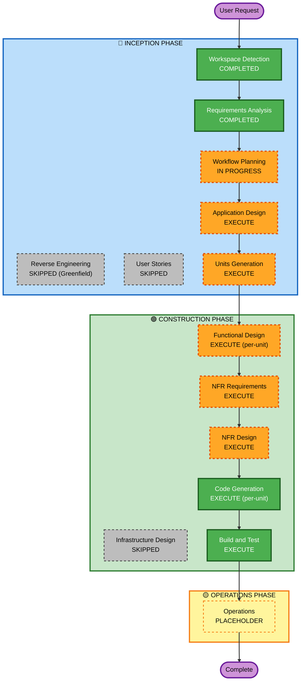

# Execution Plan

## Detailed Analysis Summary

### Change Impact Assessment
- **User-facing changes**: Yes — REST API 신규 구현 (POST /api/v1/midpoint, POST /api/v1/recommend, GET /health)
- **Structural changes**: Yes — 클린 아키텍처 4레이어 (Domain / Application / Infrastructure / API) 신규 설계
- **Data model changes**: Yes — 장소 도메인 모델, 좌표 모델, 검색 결과 모델 신규 정의
- **API changes**: Yes — 전체 API 신규 설계 (where-meeting 참조, 아키텍처 재설계)
- **NFR impact**: Yes — Hypothesis PBT 전체 적용, 확장 가능한 Repository 인터페이스 설계

### Risk Assessment
- **Risk Level**: Medium
- **Rollback Complexity**: Easy (Greenfield, 언제든 초기화 가능)
- **Testing Complexity**: Moderate (단위 + 통합 + PBT 3종)

---

## Workflow Visualization



### Text Alternative

```
INCEPTION PHASE:
  [DONE]  Workspace Detection
  [SKIP]  Reverse Engineering (Greenfield - 불필요)
  [DONE]  Requirements Analysis
  [SKIP]  User Stories (요구사항이 명확하고 소규모 팀)
  [WIP]   Workflow Planning (현재 단계)
  [NEXT]  Application Design
  [NEXT]  Units Generation

CONSTRUCTION PHASE (per-unit):
  [NEXT]  Functional Design
  [NEXT]  NFR Requirements (Hypothesis PBT 프레임워크 선택)
  [NEXT]  NFR Design (PBT 전략 설계)
  [SKIP]  Infrastructure Design (프로토타입 수준, 클라우드 없음)
  [NEXT]  Code Generation
  [NEXT]  Build and Test

OPERATIONS PHASE:
  [HOLD]  Operations (Placeholder)
```

---

## Phases to Execute

### 🔵 INCEPTION PHASE
- [x] Workspace Detection — COMPLETED
- [x] Reverse Engineering — SKIPPED (Greenfield 프로젝트)
- [x] Requirements Analysis — COMPLETED
- [ ] User Stories — **SKIPPED**
  - **Rationale**: 요구사항이 API 스펙 수준까지 명확히 정의됨. 소규모 팀. User Stories가 추가 가치를 제공하지 않는 상황.
- [x] Workflow Planning — IN PROGRESS
- [ ] Application Design — **EXECUTE**
  - **Rationale**: 신규 시스템. 클린 아키텍처 컴포넌트 설계 필요 (StationRepository 인터페이스, 서비스 레이어, 의존성 주입 구조).
- [ ] Units Generation — **EXECUTE**
  - **Rationale**: 여러 논리 모듈 (Location, RAG, API 레이어) 분해 및 개발 순서 결정 필요.

### 🟢 CONSTRUCTION PHASE
- [ ] Functional Design — **EXECUTE** (per-unit)
  - **Rationale**: 복잡한 비즈니스 로직 (Haversine, 중간지점 계산, RAG 파이프라인). PBT-01 규칙에 따라 각 컴포넌트의 테스트 가능 속성 식별 필수.
- [ ] NFR Requirements — **EXECUTE**
  - **Rationale**: PBT 프레임워크 선택 (Hypothesis), 성능 요구사항 문서화.
- [ ] NFR Design — **EXECUTE**
  - **Rationale**: Hypothesis 전략(strategy) 설계, PBT 패턴 적용 방법 결정.
- [ ] Infrastructure Design — **SKIPPED**
  - **Rationale**: 프로토타입 수준. 로컬 ChromaDB, 클라우드 인프라 없음. Docker 컨테이너화 미적용.
- [ ] Code Generation — EXECUTE (ALWAYS)
- [ ] Build and Test — EXECUTE (ALWAYS)

### 🟡 OPERATIONS PHASE
- [ ] Operations — PLACEHOLDER

---

## Estimated Timeline
- **Total Stages to Execute**: 8 (Application Design, Units Generation, Functional Design×N, NFR Requirements, NFR Design, Code Generation×N, Build and Test)
- **Estimated Sessions**: 3-5 sessions

## Success Criteria
- **Primary Goal**: 클린 아키텍처 기반 RAG 장소 추천 FastAPI 서비스 구현
- **Key Deliverables**:
  - `POST /api/v1/midpoint` — 다중 출발지 → 중간지점 계산
  - `POST /api/v1/recommend` — 중간지점 기준 RAG 장소 추천
  - `StationRepository` 인터페이스 (카카오 API 확장 가능)
  - Hypothesis PBT 테스트 (거리 계산, 중간지점 교환법칙 등)
  - 단위 + 통합 테스트 커버리지
- **Quality Gates**:
  - PBT-01 ~ PBT-10 전체 규칙 준수
  - 모든 단위 테스트 통과
  - API 통합 테스트 통과
